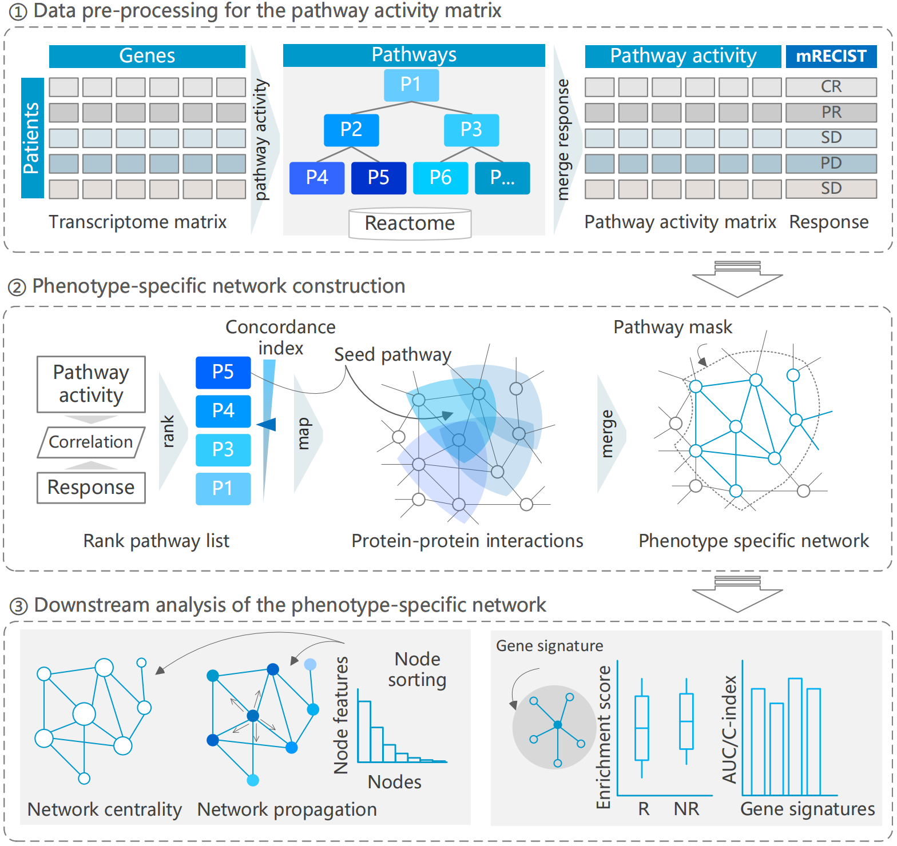

## Biomarker Discovery Guided by a Pathway-Masked Phenotype-Specific Network for Pan-Cancer Immunotherapy Responses

- The `code.Rmd` file contains the complete code used to generate the main results presented in our paper.  
- The `data/` directory includes both raw input data and intermediate results.

The full workflow for constructing the phenotype-specific network—including sample-pathway matrix computation, pathway ranking, and downstream network analysis—is illustrated in the figure below:

The `code.Rmd` file is structured according to this workflow and provides detailed step-by-step implementation.

This work is cited by:  
*(Citation information to be provided soon.)*
